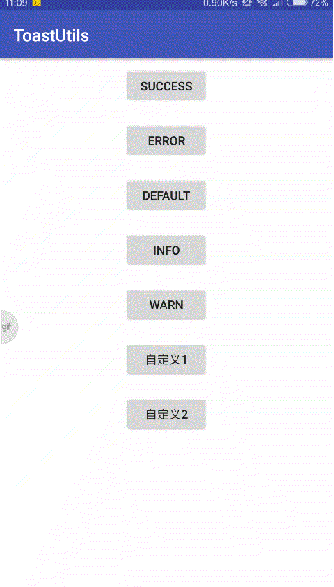

## 版本计划

- v1.0.0  添加各式各样的toast,并提供自定义toast
- v1.1.0  给不同种类的toast加上合适的动画，并提供自定义动画
- v1.2.0  未完待续...



### 使用方式
Step 1. Add the JitPack repository to your build file
```
allprojects {
    repositories {
        ...
        maven { url 'https://jitpack.io' }
    }
}
```

Step 2. Add the dependency
```
dependencies {
    compile 'com.github.mengpeng920223:ToastUtils:v1.0.1'
}
```

### 初始化
```
 ToastUtils.getInstance().initToast(context);
```

### 成功Toast
```
ToastUtils.onSuccessShowToast(context, "成功toast")
```
### 失败Toast
```
ToastUtils.onErrorShowToast(context, "失败toast")
```
### 默认Toast
```
ToastUtils.onDefaultShowToast(context, "默认toast")
```

### 默认没有icon Toast
```
ToastUtils.onDefaultWithoutIconShowToast(context, "默认没有 icon toast")
```
### Warn Toast
```
ToastUtils.onWarnShowToast(context, "Warn toast")
```
### Info Toast
```
ToastUtils.onInfoShowToast(context, "Info toast")
```

### 自定义Toast(建议看源码，然后选择构建方式)
```
ToastUtils.onShowToast(...)
```
